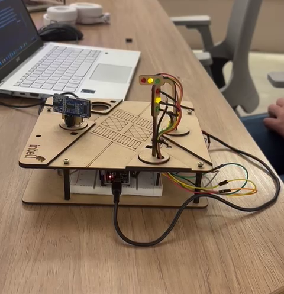

# Projeto Semáforo Inteligente 🚦

Este projeto consiste no desenvolvimento de um sistema de semáforos inteligentes utilizando ESP32, sensores ultrassônicos e de luminosidade, integrados a um sistema MQTT para comunicação entre dispositivos. O objetivo principal é proporcionar uma gestão eficiente do tráfego urbano, adaptando o comportamento dos semáforos às condições reais de trânsito e luminosidade.

---

## Visão Geral do Sistema

<div align="center">
    
</div>

### 1. **Detecção de Veículos**

- **Sensor Ultrassônico**: Instalado em uma rua menor para detectar a presença de veículos. Quando um carro é detectado, o semáforo da rua menor muda para verde, enquanto o da avenida principal fica vermelho, garantindo que o veículo possa atravessar.
- **Funcionamento**:
  - O sensor mede a distância de objetos à frente. Caso a distância seja menor que 5 cm, o sistema identifica a presença de um carro.
  - Após a detecção, o semáforo realiza um ciclo: verde → amarelo → vermelho.

---

### 2. **Modo Noturno**

- **Sensor de Luz (LDR)**: Detecta a luminosidade ambiente. Quando o nível de luz está baixo, o sistema entra no "modo noturno".
- **Comportamento Noturno**:
  - Os LEDs dos semáforos piscam em amarelo, indicando atenção aos motoristas.
  - Este comportamento reduz o consumo de energia em horários de menor tráfego.

---

### 3. **Comunicação MQTT**

- Os ESP32 estão conectados a um broker MQTT seguro com TLS, utilizando a plataforma HiveMQ.
- **Tópicos MQTT**:
  - **`ponderada/semaforos`**: Mensagens como "noite" ou "carro detectado" são enviadas para sincronizar os semáforos e ajustar seu comportamento.
- **Uso no Projeto**:
  - O ESP32 do sensor ultrassônico publica "carro detectado" ao identificar um veículo, ativando o ciclo do semáforo.
  - O ESP32 do LDR publica "noite" ao detectar baixa luminosidade, ativando o modo noturno em ambos os semáforos.

---

## Componentes Utilizados

1. **Hardware**:

   - ESP32 (2 unidades): Para controle dos semáforos e comunicação MQTT.
   - Sensor Ultrassônico (HC-SR04): Para detecção de veículos.
   - Sensor LDR: Para detecção de luminosidade.
   - LEDs (Vermelho, Amarelo, Verde): Representação dos semáforos.
   - Resistores e jumpers: Para montagem dos circuitos.
   - Protoboard.

2. **Software**:
   - Plataforma Arduino IDE: Para desenvolvimento do código dos ESP32.
   - HiveMQ (broker MQTT): Para comunicação entre os dispositivos.
   - Wi-Fi: Conexão dos ESP32 ao broker MQTT.

---

## Fluxo de Operação

### Funcionamento Normal (Diurno)

1. O **sensor ultrassônico** detecta veículos na rua menor.
2. Caso um veículo seja detectado:
   - O semáforo da rua menor fica verde, enquanto o da avenida principal fica vermelho.
   - Após 4 segundos, o semáforo da rua menor passa para amarelo por 1 segundo.
   - Ambos os semáforos retornam aos estados padrão: avenida principal em verde, rua menor em vermelho.
3. Caso não haja veículos detectados, o semáforo da avenida principal permanece verde continuamente.

---

### Funcionamento em Modo Noturno

1. O **sensor LDR** detecta baixa luminosidade.
2. Uma mensagem "noite" é enviada via MQTT.
3. Ambos os semáforos piscam em amarelo intermitente, indicando atenção.

---

## Código Implementado

### ESP32 (Sensor Ultrassônico)

- Configuração do sensor ultrassônico para medir distâncias e detectar veículos.
- Publicação de mensagens MQTT para indicar a presença de veículos.
- Controle do ciclo do semáforo (verde → amarelo → vermelho).

**Trechos Relevantes**:

```cpp
if (distance > 0 && distance < 5) {
    sendCarDetected();
    digitalWrite(LED_RED_PIN, LOW);
    digitalWrite(LED_GREEN_PIN, HIGH);
    delay(4000);
    digitalWrite(LED_GREEN_PIN, LOW);
    digitalWrite(LED_YELLOW_PIN, HIGH);
    delay(1000);
    digitalWrite(LED_YELLOW_PIN, LOW);
    digitalWrite(LED_RED_PIN, HIGH);
}
```

### ESP32 (Sensor LDR)

- Leitura da luminosidade para determinar se é noite.
- Publicação de mensagens MQTT ("noite") para sincronizar o modo noturno entre os semáforos.

**Trechos Relevantes**:

```cpp
if (analogRead(LDR_PIN) < 500) { // Limite ajustável para baixa luz
    client.publish("ponderada/semaforos", "noite");
}
```

---

## Demonstração do Funcionamento

Os vídeos de demonstração do funcionamento dos sensores estão disponíveis no repositório, no diretório `./assets`. Você pode baixá-los para visualização.

- **Vídeo 1 - Sensor Ultrassônico**: Mostra a detecção de veículos e o ciclo dos semáforos.  
  [Assista aqui](./assets/demo1Ultrassonic.mp4)
- **Vídeo 2 - Sensor de Luminosidade**: Mostra o sistema alternando para o modo noturno com LEDs piscando.  
  [Assista aqui](./assets/demo2Ldr.mp4)

---

## Código-Fonte

O código para cada sensor está organizado no diretório `./code`. Confira os arquivos específicos:

- [Código para Sensor LDR](./code/espLdr.cpp)
- [Código para Sensor Ultrassônico](./code/espUltrasonic.cpp)

---

## Conclusão

Este projeto demonstra como tecnologias IoT podem ser aplicadas para melhorar a gestão do tráfego em cidades modernas. A integração de sensores e comunicação MQTT permite:

- **Detecção eficiente de veículos**.
- **Adaptação ao ambiente** (como o modo noturno).
- **Comunicação em tempo real** entre os semáforos.

Essas soluções podem ser escaladas para sistemas maiores, contribuindo para a construção de cidades mais inteligentes e conectadas.